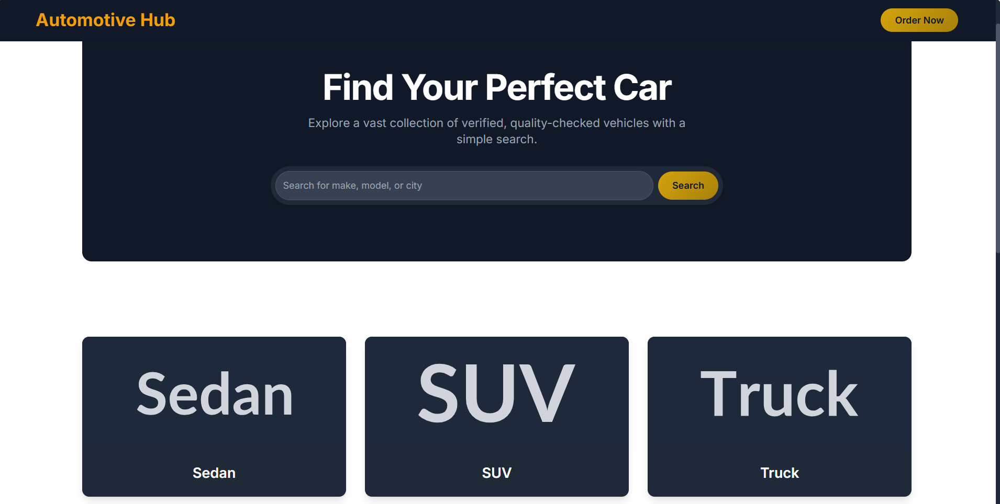
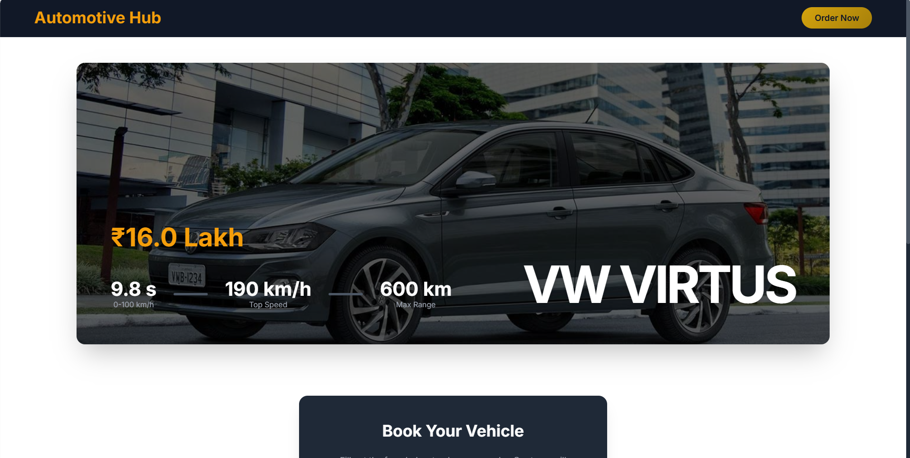
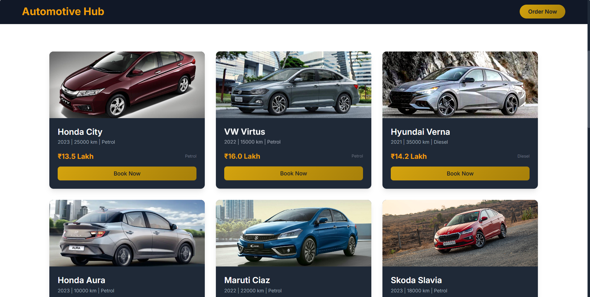
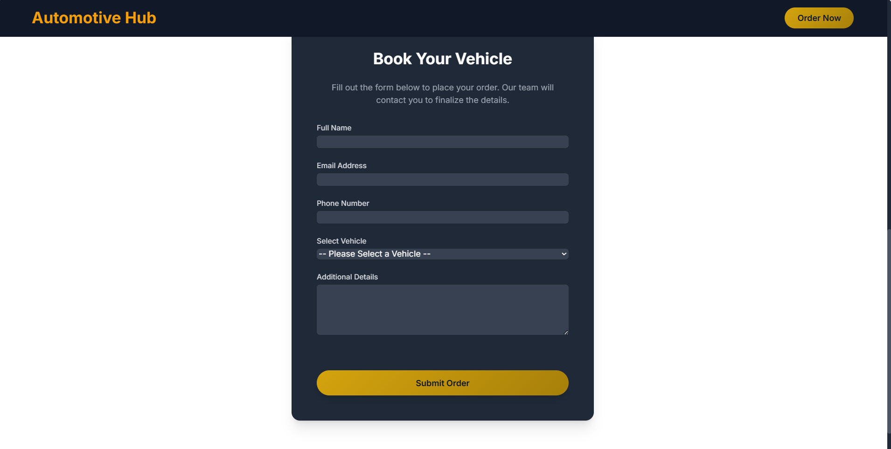
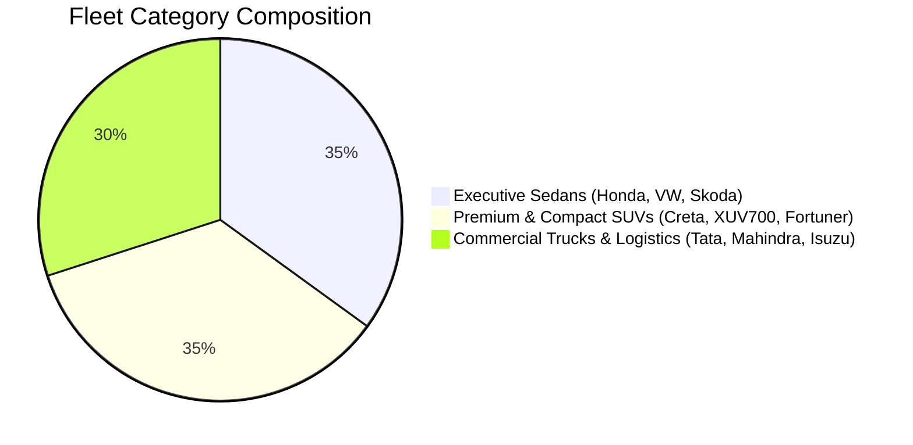
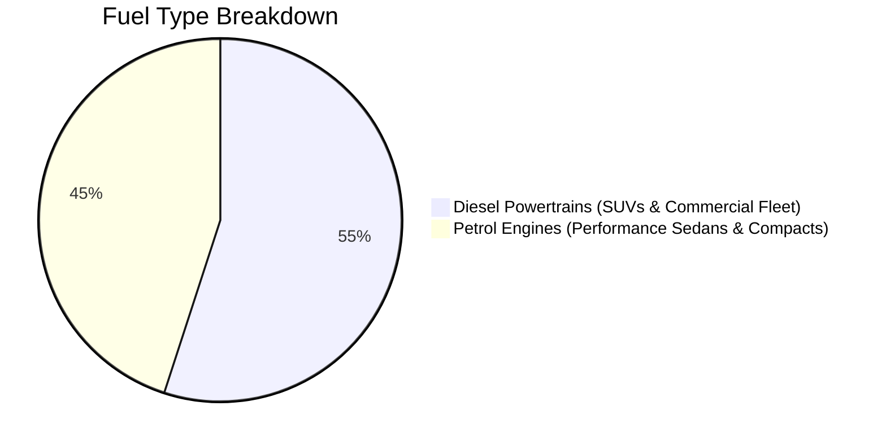
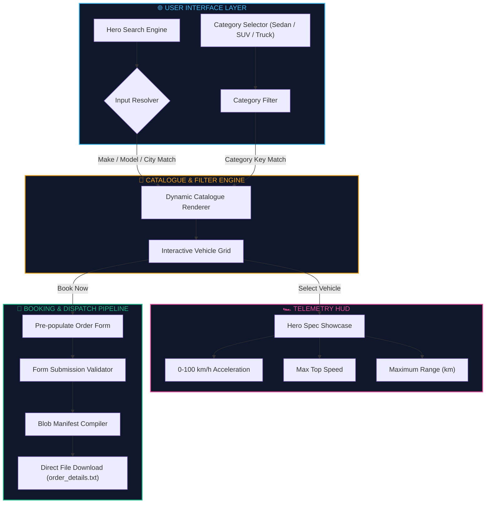

<div align="center">

<h1 style="font-family: 'Cooper Black', 'Arial Black', serif; font-size: 3.8rem; letter-spacing: 2px; color: #f59e0b; margin-bottom: 2px; text-shadow: 0 0 25px rgba(245, 158, 11, 0.45);">
  🏎️ AUTOMOTIVE HUB 🏎️
</h1>

<h3 style="font-family: 'Bookman Old Style', 'URW Bookman', 'Georgia', serif; font-weight: 500; color: #fbbf24; margin-top: 6px; letter-spacing: 0.8px;">
  ◈ <i>Next-Gen Vehicle Discovery, Spec Telemetry & Direct Booking Portal</i> ◈
</h3>

<br/>

[](https://developer.mozilla.org/en-US/docs/Web/HTML)
[](https://developer.mozilla.org/en-US/docs/Web/JavaScript)
[](https://tailwindcss.com/)
[](style.css)
[](#)
[](LICENSE)

<br/>

<p align="center" style="font-family: 'Bookman Old Style', 'URW Bookman', serif; font-size: 1.05rem;">
  <b>✦ <a href="#01-platform-overview">Overview</a> ✦</b> &nbsp;•&nbsp;
  <b>✦ <a href="#02-portal-interface-gallery">Visual Gallery</a> ✦</b> &nbsp;•&nbsp;
  <b>✦ <a href="#03-fleet-analytics--telemetry">Fleet Analytics</a> ✦</b> &nbsp;•&nbsp;
  <b>✦ <a href="#04-vehicle-inventory--specs">Fleet Matrix</a> ✦</b> &nbsp;•&nbsp;
  <b>✦ <a href="#05-system-architecture">Architecture</a> ✦</b> &nbsp;•&nbsp;
  <b>✦ <a href="#06-installation--quick-start">Quick Start</a> ✦</b> &nbsp;•&nbsp;
  <b>✦ <a href="#07-booking-manifest-format">Manifest Export</a> ✦</b>
</p>

---

</div>

<h2 id="01-platform-overview" style="font-family: 'Bookman Old Style', 'URW Bookman', 'Georgia', serif; color: #f59e0b;">🌌 01. Platform Overview</h2>

<p style="font-family: 'Bookman Old Style', 'URW Bookman', serif; font-size: 1.05rem; line-height: 1.7;">
<b>Automotive Hub</b> is an ultra-sleek, interactive vehicle discovery and dealership booking application. Designed with a dark obsidian aesthetic and lustrous gold accents, it pairs dynamic vehicle performance telemetry (0–100 km/h acceleration curves, top speed ceilings, and maximum range indices) with multi-category fleet filtering, responsive search indexing, and client-side booking manifest generation.
</p>

```
  ┌─────────────────────────┐      ┌─────────────────────────┐      ┌─────────────────────────┐
  │  🔍 Search & Filter Hub │ ──❯  │🏎️ Dynamic Telemetry HUD│ ──❯  │ 📝 Client Booking Form  │
  │  (Make, City, Category) │      │ (Speed / Range / 0-100) │      │  (Manifest .txt Export) │
  └─────────────────────────┘      └─────────────────────────┘      └─────────────────────────┘
```

> [!NOTE]
> **Client-Side Manifest Generation**: Automotive Hub operates seamlessly without external backend dependencies, dynamically building and initiating direct download of customized transaction receipts and booking orders.

---

<h2 id="02-portal-interface-gallery" style="font-family: 'Bookman Old Style', 'URW Bookman', 'Georgia', serif; color: #f59e0b;">📸 02. Portal Interface Gallery</h2>

<div align="center">

### 🌟 Interactive Discovery & Dynamic Showcase
<kbd>
  
</kbd>

<br/>
<sub style="font-family: 'Bookman Old Style', 'URW Bookman', serif;"><b>◈ Figure 1.0:</b> Hero portal featuring live search discovery and high-resolution spec telemetry.</sub>

<br/><br/>

### 🏎️ Vehicle Fleet Catalogue & Category Indexing
<kbd>
  
</kbd>

<br/>
<sub style="font-family: 'Bookman Old Style', 'URW Bookman', serif;"><b>◈ Figure 2.0:</b> Real-time category-filtered grid displaying pricing, mileage, and transmission details.</sub>

<br/><br/>

### 🚛 Multi-Segment Verticals & Commercial Logistics
<kbd>
  
</kbd>

<br/>
<sub style="font-family: 'Bookman Old Style', 'URW Bookman', serif;"><b>◈ Figure 3.0:</b> Multi-segment vehicle breakdown spanning Sedans, SUVs, and heavy-duty Commercial Trucks.</sub>

<br/><br/>

### 📝 Client Reservation & Order Dispatch Console
<kbd>
  
</kbd>

<br/>
<sub style="font-family: 'Bookman Old Style', 'URW Bookman', serif;"><b>◈ Figure 4.0:</b> Integrated booking console with auto-populated vehicle selector and instant manifest generation.</sub>

</div>

---

<h2 id="03-fleet-analytics--telemetry" style="font-family: 'Bookman Old Style', 'URW Bookman', 'Georgia', serif; color: #f59e0b;">📊 03. Fleet Analytics & Telemetry</h2>

### 🚗 Vehicle Fleet Inventory Distribution


### ⛽ Powertrain & Fuel Demographics


---

<h2 id="04-vehicle-inventory--specs" style="font-family: 'Bookman Old Style', 'URW Bookman', 'Georgia', serif; color: #f59e0b;">⚡ 04. Vehicle Fleet Matrix</h2>

<p style="font-family: 'Bookman Old Style', 'URW Bookman', serif; font-size: 1.02rem;">
Automotive Hub manages verified inventory records paired with real-time performance specs:
</p>

| Vehicle Class | Flagship Models | Price Range | 0–100 km/h | Top Speed | Max Range | Primary Fuel |
| :--- | :--- | :---: | :---: | :---: | :---: | :---: |
| **Executive Sedans** | *Honda City, VW Virtus, Skoda Slavia, Hyundai Verna* | `₹8.5L - ₹16.0L` | **9.5s – 12.0s** | `150 - 195 km/h` | `480 - 650 km` | Petrol / Diesel |
| **Premium SUVs** | *Mahindra XUV700, Toyota Fortuner, Jeep Compass* | `₹13.5L - ₹45.0L` | **9.2s – 12.0s** | `170 - 200 km/h` | `550 - 700 km` | Diesel / Petrol |
| **Compact SUVs** | *Tata Nexon, Maruti Brezza, Skoda Kushaq, Taigun* | `₹13.5L - ₹18.5L` | **9.8s – 11.0s** | `170 - 188 km/h` | `550 - 590 km` | Petrol |
| **Commercial Logistics** | *Tata Signa, BharatBenz 1117, Isuzu D-Max, Bolero* | `₹7.5L - ₹30.0L` | **11.0s – 15.0s** | `80 - 120 km/h` | `400 - 700 km` | Heavy-Duty Diesel |

---

<h2 id="05-system-architecture" style="font-family: 'Bookman Old Style', 'URW Bookman', 'Georgia', serif; color: #f59e0b;">🧬 05. System Architecture</h2>



---

<h2 id="06-installation--quick-start" style="font-family: 'Bookman Old Style', 'URW Bookman', 'Georgia', serif; color: #f59e0b;">🚀 06. Installation & Quick Start</h2>

### 📋 Prerequisites
- Any modern web browser (**Chrome**, **Firefox**, **Edge**, **Safari**)
- Optional: Local HTTP server (e.g., Live Server extension or Python `http.server`)

### 🔧 Setup & Execution

```bash
# 1. Clone the repository
git clone https://github.com/<your-username>/automotive-hub.git
cd "automotive hub"

# 2. Option A: Direct browser launch
# Double-click index.html or open it directly in your browser

# 3. Option B: Serve locally via Python
python -m http.server 8000

# 4. Access the portal at:
# http://localhost:8000
```

---

<h2 id="07-booking-manifest-format" style="font-family: 'Bookman Old Style', 'URW Bookman', 'Georgia', serif; color: #f59e0b;">💾 07. Booking Manifest Format</h2>

<p style="font-family: 'Bookman Old Style', 'URW Bookman', serif; font-size: 1.02rem;">
When users submit a booking reservation, a structured booking manifest file (<code>order_details.txt</code>) is dynamically packaged and downloaded:
</p>

<details open>
<summary><b>📄 Client Booking Manifest (<code>order_details.txt</code>)</b></summary>

```text
--- Automotive Hub Order Details ---

Order Date: 9/26/2026, 11:00:00 PM
Customer Name: Priyanshu Sharma
Email: priyanshu@example.com
Phone Number: +91 98765 43210
Selected Vehicle: Mahindra XUV700
Additional Details: Requesting test drive availability for the AX7 Luxury Diesel AT variant.
```
</details>

---

<h2 id="08-project-structure" style="font-family: 'Bookman Old Style', 'URW Bookman', 'Georgia', serif; color: #f59e0b;">📂 08. Project Structure</h2>

```text
automotive hub/
├── Homepage.png         # Screenshot: Hero search & telemetry display
├── catalogue.png        # Screenshot: Vehicle grid catalogue
├── verticals.png        # Screenshot: Category & vertical breakdown
├── order.png            # Screenshot: Direct reservation modal
├── index.html           # Core semantic HTML5 application structure
├── style.css            # Custom CSS keyframes, scrollbar & animations
├── script.js            # Dataset, search filter engine & manifest export
└── README.md            # Comprehensive project documentation
```

---

<h2 id="09-license" style="font-family: 'Bookman Old Style', 'URW Bookman', 'Georgia', serif; color: #f59e0b;">📜 09. License</h2>

Distributed under the **[MIT License](LICENSE)**.

<div align="center">

---

⭐ **Star this repository if you find Automotive Hub valuable for your automotive projects!** ⭐

<p style="font-family: 'Bookman Old Style', 'URW Bookman', serif; color: #94a3b8; margin-top: 8px;">
  Crafted with 🏎️ by <b>Priyanshu Pundir</b>
</p>

</div>
